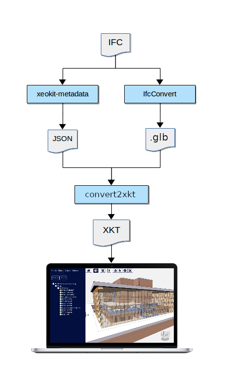
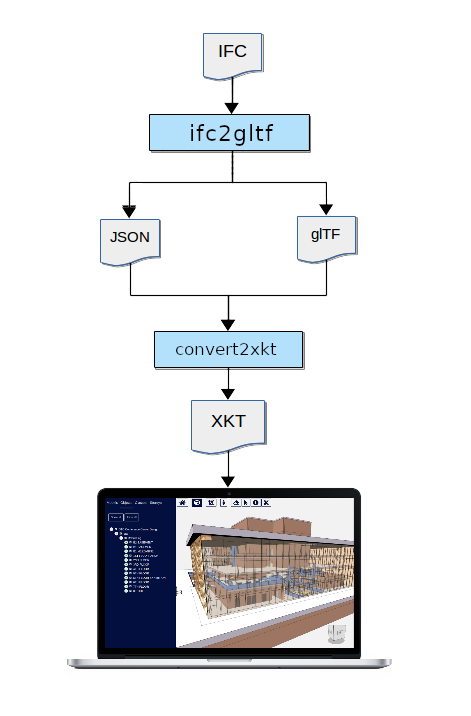

# Contents

TODO

- [Conversion Results](#conversion-results)
    + [IfcOpenHouse2x3](#ifcopenhouse2x3)
    + [IfcOpenHouse4](#ifcopenhouse4)

- [Appendix A: Conversion Pipelines](#conversion-results)
    * [WebIFCLoaderPlugin](#webifcloaderplugin)
    * [Community Pipeline #1](#community-pipeline--1)
    * [Community Pipeline #2](#community-pipeline--2)
    * [Enterprise Pipeline #1](#enterprise-pipeline--1)

# Introduction

TODO
* [Source code](https://github.com/xeokit/xeokit-pipeline)


# Results


* Updated: Thu Sep 08 2022 03:43:15 GMT+0200 (Central European Summer Time)


### Duplex


| View Model | IFC Conversion Pipeline | Conversion Log |
| --- | --- | --- |
| [.ifc](viewModel.html?src=converted/Duplex/model.ifc) | [WebIFCLoaderPlugin](https://xeokit.github.io/xeokit-sdk/docs/class/src/plugins/WebIFCLoaderPlugin/WebIFCLoaderPlugin.js~WebIFCLoaderPlugin.html) | NA |
| [.glb](viewModel.html?src=converted/Duplex/community1/model.glb) | [Community Pipeline #1](#community-pipeline-1) | [Log](converted/Duplex/community1/log.txt) |
| [.glb](viewModel.html?src=converted/Duplex/enterprise1/model.glb) | [Enterprise Pipeline #1](#enterprise-pipeline-1) | [Log](converted/Duplex/enterprise1/log.txt) |
| [.glb + .json](viewModel.html?src=converted/Duplex/community1/model.glb&metaModelSrc=converted/Duplex/community1/model.json) | [Community Pipeline #1](#community-pipeline-1)  | [Log](converted/Duplex/community1/log.txt) |
| [.glb + .json](viewModel.html?src=converted/Duplex/enterprise1/model.glb&metaModelSrc=converted/Duplex/enterprise1/model.json) | [Enterprise Pipeline #1](#enterprise-pipeline-1)  | [Log](converted/Duplex/enterprise1/log.txt) |
| [.xkt](viewModel.html?src=converted/Duplex/community1/model.xkt) | [Community Pipeline #1](#community-pipeline-1) | [Log](converted/Duplex/community1/log.txt) |
| [.xkt](viewModel.html?src=converted/Duplex/community2/model.xkt) | [Community Pipeline #2](#community-pipeline-2) | [Log](converted/Duplex/community2/log.txt) |
| [.xkt](viewModel.html?src=converted/Duplex/enterprise1/model.xkt)| [Enterprise Pipeline #1](#enterprise-pipeline-1) | [Log](converted/Duplex/enterprise1/log.txt) |


### IfcOpenHouse2x3


| View Model | IFC Conversion Pipeline | Conversion Log |
| --- | --- | --- |
| [.ifc](viewModel.html?src=converted/IfcOpenHouse2x3/model.ifc) | [WebIFCLoaderPlugin](https://xeokit.github.io/xeokit-sdk/docs/class/src/plugins/WebIFCLoaderPlugin/WebIFCLoaderPlugin.js~WebIFCLoaderPlugin.html) | NA |
| [.glb](viewModel.html?src=converted/IfcOpenHouse2x3/community1/model.glb) | [Community Pipeline #1](#community-pipeline-1) | [Log](converted/IfcOpenHouse2x3/community1/log.txt) |
| [.glb](viewModel.html?src=converted/IfcOpenHouse2x3/enterprise1/model.glb) | [Enterprise Pipeline #1](#enterprise-pipeline-1) | [Log](converted/IfcOpenHouse2x3/enterprise1/log.txt) |
| [.glb + .json](viewModel.html?src=converted/IfcOpenHouse2x3/community1/model.glb&metaModelSrc=converted/IfcOpenHouse2x3/community1/model.json) | [Community Pipeline #1](#community-pipeline-1)  | [Log](converted/IfcOpenHouse2x3/community1/log.txt) |
| [.glb + .json](viewModel.html?src=converted/IfcOpenHouse2x3/enterprise1/model.glb&metaModelSrc=converted/IfcOpenHouse2x3/enterprise1/model.json) | [Enterprise Pipeline #1](#enterprise-pipeline-1)  | [Log](converted/IfcOpenHouse2x3/enterprise1/log.txt) |
| [.xkt](viewModel.html?src=converted/IfcOpenHouse2x3/community1/model.xkt) | [Community Pipeline #1](#community-pipeline-1) | [Log](converted/IfcOpenHouse2x3/community1/log.txt) |
| [.xkt](viewModel.html?src=converted/IfcOpenHouse2x3/community2/model.xkt) | [Community Pipeline #2](#community-pipeline-2) | [Log](converted/IfcOpenHouse2x3/community2/log.txt) |
| [.xkt](viewModel.html?src=converted/IfcOpenHouse2x3/enterprise1/model.xkt)| [Enterprise Pipeline #1](#enterprise-pipeline-1) | [Log](converted/IfcOpenHouse2x3/enterprise1/log.txt) |


### IfcOpenHouse4


| View Model | IFC Conversion Pipeline | Conversion Log |
| --- | --- | --- |
| [.ifc](viewModel.html?src=converted/IfcOpenHouse4/model.ifc) | [WebIFCLoaderPlugin](https://xeokit.github.io/xeokit-sdk/docs/class/src/plugins/WebIFCLoaderPlugin/WebIFCLoaderPlugin.js~WebIFCLoaderPlugin.html) | NA |
| [.glb](viewModel.html?src=converted/IfcOpenHouse4/community1/model.glb) | [Community Pipeline #1](#community-pipeline-1) | [Log](converted/IfcOpenHouse4/community1/log.txt) |
| [.glb](viewModel.html?src=converted/IfcOpenHouse4/enterprise1/model.glb) | [Enterprise Pipeline #1](#enterprise-pipeline-1) | [Log](converted/IfcOpenHouse4/enterprise1/log.txt) |
| [.glb + .json](viewModel.html?src=converted/IfcOpenHouse4/community1/model.glb&metaModelSrc=converted/IfcOpenHouse4/community1/model.json) | [Community Pipeline #1](#community-pipeline-1)  | [Log](converted/IfcOpenHouse4/community1/log.txt) |
| [.glb + .json](viewModel.html?src=converted/IfcOpenHouse4/enterprise1/model.glb&metaModelSrc=converted/IfcOpenHouse4/enterprise1/model.json) | [Enterprise Pipeline #1](#enterprise-pipeline-1)  | [Log](converted/IfcOpenHouse4/enterprise1/log.txt) |
| [.xkt](viewModel.html?src=converted/IfcOpenHouse4/community1/model.xkt) | [Community Pipeline #1](#community-pipeline-1) | [Log](converted/IfcOpenHouse4/community1/log.txt) |
| [.xkt](viewModel.html?src=converted/IfcOpenHouse4/community2/model.xkt) | [Community Pipeline #2](#community-pipeline-2) | [Log](converted/IfcOpenHouse4/community2/log.txt) |
| [.xkt](viewModel.html?src=converted/IfcOpenHouse4/enterprise1/model.xkt)| [Enterprise Pipeline #1](#enterprise-pipeline-1) | [Log](converted/IfcOpenHouse4/enterprise1/log.txt) |


### MAP


| View Model | IFC Conversion Pipeline | Conversion Log |
| --- | --- | --- |
| [.ifc](viewModel.html?src=converted/MAP/model.ifc) | [WebIFCLoaderPlugin](https://xeokit.github.io/xeokit-sdk/docs/class/src/plugins/WebIFCLoaderPlugin/WebIFCLoaderPlugin.js~WebIFCLoaderPlugin.html) | NA |
| [.glb](viewModel.html?src=converted/MAP/community1/model.glb) | [Community Pipeline #1](#community-pipeline-1) | [Log](converted/MAP/community1/log.txt) |
| [.glb](viewModel.html?src=converted/MAP/enterprise1/model.glb) | [Enterprise Pipeline #1](#enterprise-pipeline-1) | [Log](converted/MAP/enterprise1/log.txt) |
| [.glb + .json](viewModel.html?src=converted/MAP/community1/model.glb&metaModelSrc=converted/MAP/community1/model.json) | [Community Pipeline #1](#community-pipeline-1)  | [Log](converted/MAP/community1/log.txt) |
| [.glb + .json](viewModel.html?src=converted/MAP/enterprise1/model.glb&metaModelSrc=converted/MAP/enterprise1/model.json) | [Enterprise Pipeline #1](#enterprise-pipeline-1)  | [Log](converted/MAP/enterprise1/log.txt) |
| [.xkt](viewModel.html?src=converted/MAP/community1/model.xkt) | [Community Pipeline #1](#community-pipeline-1) | [Log](converted/MAP/community1/log.txt) |
| [.xkt](viewModel.html?src=converted/MAP/community2/model.xkt) | [Community Pipeline #2](#community-pipeline-2) | [Log](converted/MAP/community2/log.txt) |
| [.xkt](viewModel.html?src=converted/MAP/enterprise1/model.xkt)| [Enterprise Pipeline #1](#enterprise-pipeline-1) | [Log](converted/MAP/enterprise1/log.txt) |


### rac_advanced_sample_project


| View Model | IFC Conversion Pipeline | Conversion Log |
| --- | --- | --- |
| [.ifc](viewModel.html?src=converted/rac_advanced_sample_project/model.ifc) | [WebIFCLoaderPlugin](https://xeokit.github.io/xeokit-sdk/docs/class/src/plugins/WebIFCLoaderPlugin/WebIFCLoaderPlugin.js~WebIFCLoaderPlugin.html) | NA |
| [.glb](viewModel.html?src=converted/rac_advanced_sample_project/community1/model.glb) | [Community Pipeline #1](#community-pipeline-1) | [Log](converted/rac_advanced_sample_project/community1/log.txt) |
| [.glb](viewModel.html?src=converted/rac_advanced_sample_project/enterprise1/model.glb) | [Enterprise Pipeline #1](#enterprise-pipeline-1) | [Log](converted/rac_advanced_sample_project/enterprise1/log.txt) |
| [.glb + .json](viewModel.html?src=converted/rac_advanced_sample_project/community1/model.glb&metaModelSrc=converted/rac_advanced_sample_project/community1/model.json) | [Community Pipeline #1](#community-pipeline-1)  | [Log](converted/rac_advanced_sample_project/community1/log.txt) |
| [.glb + .json](viewModel.html?src=converted/rac_advanced_sample_project/enterprise1/model.glb&metaModelSrc=converted/rac_advanced_sample_project/enterprise1/model.json) | [Enterprise Pipeline #1](#enterprise-pipeline-1)  | [Log](converted/rac_advanced_sample_project/enterprise1/log.txt) |
| [.xkt](viewModel.html?src=converted/rac_advanced_sample_project/community1/model.xkt) | [Community Pipeline #1](#community-pipeline-1) | [Log](converted/rac_advanced_sample_project/community1/log.txt) |
| [.xkt](viewModel.html?src=converted/rac_advanced_sample_project/community2/model.xkt) | [Community Pipeline #2](#community-pipeline-2) | [Log](converted/rac_advanced_sample_project/community2/log.txt) |
| [.xkt](viewModel.html?src=converted/rac_advanced_sample_project/enterprise1/model.xkt)| [Enterprise Pipeline #1](#enterprise-pipeline-1) | [Log](converted/rac_advanced_sample_project/enterprise1/log.txt) |


### rme_advanced_sample_project


| View Model | IFC Conversion Pipeline | Conversion Log |
| --- | --- | --- |
| [.ifc](viewModel.html?src=converted/rme_advanced_sample_project/model.ifc) | [WebIFCLoaderPlugin](https://xeokit.github.io/xeokit-sdk/docs/class/src/plugins/WebIFCLoaderPlugin/WebIFCLoaderPlugin.js~WebIFCLoaderPlugin.html) | NA |
| [.glb](viewModel.html?src=converted/rme_advanced_sample_project/community1/model.glb) | [Community Pipeline #1](#community-pipeline-1) | [Log](converted/rme_advanced_sample_project/community1/log.txt) |
| [.glb](viewModel.html?src=converted/rme_advanced_sample_project/enterprise1/model.glb) | [Enterprise Pipeline #1](#enterprise-pipeline-1) | [Log](converted/rme_advanced_sample_project/enterprise1/log.txt) |
| [.glb + .json](viewModel.html?src=converted/rme_advanced_sample_project/community1/model.glb&metaModelSrc=converted/rme_advanced_sample_project/community1/model.json) | [Community Pipeline #1](#community-pipeline-1)  | [Log](converted/rme_advanced_sample_project/community1/log.txt) |
| [.glb + .json](viewModel.html?src=converted/rme_advanced_sample_project/enterprise1/model.glb&metaModelSrc=converted/rme_advanced_sample_project/enterprise1/model.json) | [Enterprise Pipeline #1](#enterprise-pipeline-1)  | [Log](converted/rme_advanced_sample_project/enterprise1/log.txt) |
| [.xkt](viewModel.html?src=converted/rme_advanced_sample_project/community1/model.xkt) | [Community Pipeline #1](#community-pipeline-1) | [Log](converted/rme_advanced_sample_project/community1/log.txt) |
| [.xkt](viewModel.html?src=converted/rme_advanced_sample_project/community2/model.xkt) | [Community Pipeline #2](#community-pipeline-2) | [Log](converted/rme_advanced_sample_project/community2/log.txt) |
| [.xkt](viewModel.html?src=converted/rme_advanced_sample_project/enterprise1/model.xkt)| [Enterprise Pipeline #1](#enterprise-pipeline-1) | [Log](converted/rme_advanced_sample_project/enterprise1/log.txt) |

# Pipelines

---
There are several pipelines through which we can import an IFC file into a xeokit Viewer.

## WebIFCLoaderPlugin

This pipeline simply uses a [WebIFCLoaderPlugin]() to load an ````.ifc```` file directly into a xeokit Viewer. This is
suitable for loading small ````.ifc```` files.

## Community Pipeline #1

* Suitable for converting medium-to-large ````.ifc```` files to ````.xkt````
* Uses all open source tools
* Creates intermediate ````.glb```` and ````.json```` metadata files
* After using this pipeline, we can then view the ````.xkt````  or ````.glb```` in a
  xeokit [Viewer](https://xeokit.github.io/xeokit-sdk/docs/class/src/viewer/Viewer.js~Viewer.html), using an
  [XKTLoaderPlugin](https://xeokit.github.io/xeokit-sdk/docs/class/src/plugins/XKTLoaderPlugin/XKTLoaderPlugin.js~XKTLoaderPlugin.html)
  or
  a [GLTFLoaderPlugin](https://xeokit.github.io/xeokit-sdk/docs/class/src/plugins/GLTFLoaderPlugin/GLTFLoaderPlugin.js~GLTFLoaderPlugin.html)
  , respectively

#### Tools used:

* [IfcConvert](http://ifcopenshell.org/ifcconvert) (MIT, from [IfcOpenShell](http://ifcopenshell.org/))
* [xeokit-metadata](https://github.com/bimspot/xeokit-metadata) (MIT, from [BIMSpot](https://bimspot.io))
* [convert2xkt](https://github.com/xeokit/xeokit-convert) (AGPL3, from [xeolabs](https://xeolabs.com))

#### More info:

* Tutorial: [Converting IFC Models to XKT using Open Source Tools - A Simpler Pipeline](https://www.notion.so/xeokit/Converting-IFC-Models-to-XKT-using-Open-Source-Tools-A-Simpler-Pipeline-02d45ba457eb4f808f63bcacb71a4fb3)



## Community Pipeline #2

* Suitable for converting small ````.ifc```` files to ````.xkt````.
* Uses a single open source tool to directly convert each ````.ifc```` file to ````.xkt````, without creating
  intermediate files.
* After using this pipeline, we can then view the ````.xkt````  in a
  xeokit [Viewer](https://xeokit.github.io/xeokit-sdk/docs/class/src/viewer/Viewer.js~Viewer.html), using an
  [XKTLoaderPlugin](https://xeokit.github.io/xeokit-sdk/docs/class/src/plugins/XKTLoaderPlugin/XKTLoaderPlugin.js~XKTLoaderPlugin.html)

#### Tools used:

* [convert2xkt](https://github.com/xeokit/xeokit-convert) (AGPL3, from [xeolabs](https://xeolabs.com))

#### More info:

* Tutorial: [Converting Models to XKT with convert2xkt](https://www.notion.so/xeokit/Converting-Models-to-XKT-with-convert2xkt-fa567843313f4db8a7d6535e76da9380)


## Enterprise Pipeline #1

* Best-performing pipeline, suitable for converting large ````.ifc```` files to ````.xkt````
* Uses a combination of proprietary and open source tools
* Creates intermediate ````.glb```` and ````.json```` metadata files
* After using this pipeline, we can then view the ````.xkt````  or ````.glb```` in a
  xeokit [Viewer](https://xeokit.github.io/xeokit-sdk/docs/class/src/viewer/Viewer.js~Viewer.html), using an
  [XKTLoaderPlugin](https://xeokit.github.io/xeokit-sdk/docs/class/src/plugins/XKTLoaderPlugin/XKTLoaderPlugin.js~XKTLoaderPlugin.html)
  or
  a [GLTFLoaderPlugin](https://xeokit.github.io/xeokit-sdk/docs/class/src/plugins/GLTFLoaderPlugin/GLTFLoaderPlugin.js~GLTFLoaderPlugin.html)
  , respectively

#### Tools used:

* [ifc2gltf](https://creoox.com/en/contact/) (Closed source, from [Creoox AG](https://creoox.com/en/contact/))
* [convert2xkt](https://github.com/xeokit/xeokit-convert) (AGPL3, from [xeolabs](https://xeolabs.com))

#### More info:

* Tutorial: [Converting IFC to XKT using ifc2gltf](https://www.notion.so/xeokit/Converting-IFC-to-XKT-using-ifc2gltf-a2e0005d00dc4f22b648f1237bc3245d)

  