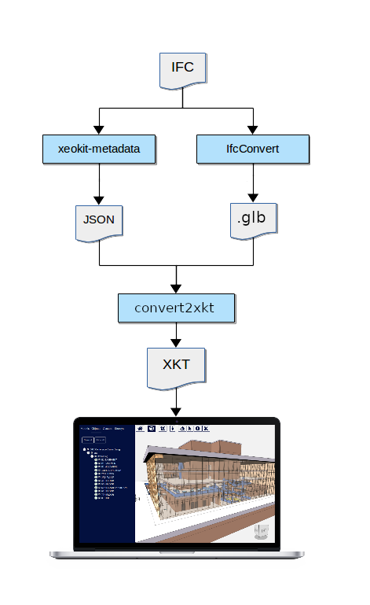
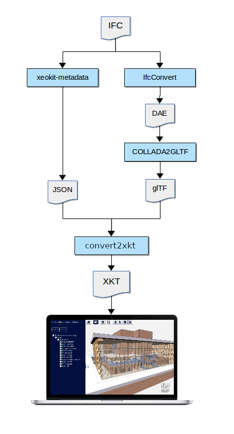
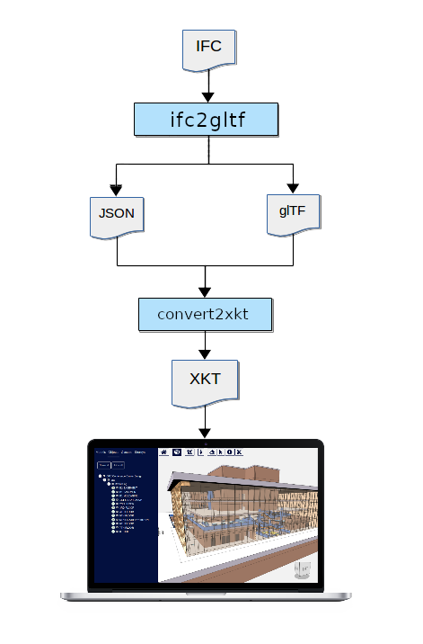

# IFC Conversion Pipelines


## Community Pipeline #1

---

This ````.ifc```` to ````.xkt```` conversion pipeline uses all open source tools, and creates intermediate ````.glb```` and ````.json```` files.

#### Tools used

* [IfcConvert](http://ifcopenshell.org/ifcconvert) (MIT)
* [xeokit-metadata](https://github.com/bimspot/xeokit-metadata) (MIT) 
* [convert2xkt](https://github.com/xeokit/xeokit-convert) (AGPL3) 

#### More info

* [Converting IFC Models to XKT using Open Source Tools - A Simpler Pipeline](https://www.notion.so/xeokit/Converting-IFC-Models-to-XKT-using-Open-Source-Tools-A-Simpler-Pipeline-02d45ba457eb4f808f63bcacb71a4fb3)




---

## Community Pipeline #2

This pipeline also uses a single open source tool to directly convert ````.ifc```` files to ````.xkt````.

#### Tools used

*  [convert2xkt](https://github.com/xeokit/xeokit-convert) (AGPL3)

#### More info

* [Converting Models to XKT with convert2xkt](https://www.notion.so/xeokit/Converting-Models-to-XKT-with-convert2xkt-fa567843313f4db8a7d6535e76da9380)



---

## Enterprise Pipeline #1

This pipeline uses a combination of proprietary and open source tools to convert ````.ifc```` to ````.xkt````.  Like *Community Pipeline #1*, this pipeline also creates intermediate ````.glb```` and ````.json```` files. 

This pipeline has the best performance for large IFC models.

#### Tools used

* [ifc2gltf](https://creoox.com/en/contact/) (Closed source)
* [convert2xkt](https://github.com/xeokit/xeokit-convert) (AGPL3)

#### More info

* [Converting IFC to XKT using ifc2gltf](https://www.notion.so/xeokit/Converting-IFC-to-XKT-using-ifc2gltf-a2e0005d00dc4f22b648f1237bc3245d)

  